# Coworking Booking System

Микросервисная система бронирования рабочих мест в университетском коворкинге. Включает REST API, мобильное и веб-приложение (Flutter), а также веб-панель администратора.

## Сервисы

Более подробное описание каждого сервиса представлено ниже

| Сервис       | Описание                                 | README                                                       |
|--------------|------------------------------------------|--------------------------------------------------------------|
| Auth         | Аутентификация, JWT, управление сессиями |[auth-service](backend/auth-service/README.md)                |
| Booking      | Бронирования, коворкинги, лейауты        |[booking-service](backend/booking-service/README.md)          |
| Notification | Уведомления (polling + FCM)              |[notification-service](backend/notification-service/README.md)|
| Analytics    | OLAP-аналитика на ClickHouse             |[analytics-service](backend/analytics-service/README.md)      |
| Scheduler    | Таймеры и отложенные задачи              |[scheduler-service](backend/scheduler-service/README.md)      |
| Gateway      | API Gateway, rate limiting, роутинг      |[gateway](backend/gateway/README.md)                          |


## Архитектура

```
   Flutter App / Web Admin
           │
           ▼
       [Gateway]  ── rate limiting, routing
           │
   ┌───────┼──────────────┐──────────────┐
   ▼       ▼              ▼              ▼
[Auth] [Booking]    [Notification]  [Analytics]  [Scheduler]
   │       │              │              │            │
Postgres Postgres     Postgres      ClickHouse    Postgres
   |       |              |              |            |
   └───────└─────────── Kafka ───────────┘────────────┘
```

Все межсервисное взаимодействие — через **Apache Kafka**. Синхронные HTTP-вызовы между сервисами отсутствуют.

## Ключевые технические решения

### 🔐 Аутентификация: RS256 + Stateful Refresh

- Access token — **stateless JWT (RS256)**. Каждый сервис валидирует токен **локально по публичному ключу** — обращения к auth-service при каждом запросе нет.
- Refresh token — **stateful**, хранится только его `hash` в БД. При обновлении происходит **ротация токена**.
- Реализовано полное управление сессиями: просмотр активных сессий, отзыв отдельной сессии, выход со всех устройств.
- Дедупликация сессий по `device_fingerprint` — пользователь видит только реальные физические устройства.

### 📬 Kafka: Outbox Pattern

Все события публикуются в Kafka через **Outbox Pattern** — событие сначала атомарно записывается в БД вместе с основной операцией, и только затем публикуется в топик. Это исключает потерю событий при сбоях сервиса.

### 🔔 Уведомления: At-Least-Once Delivery

Notification service реализует гарантию **at-least-once**: уведомление сначала записывается в Postgres, затем публикуется событие в собственный топик `notification.events`, и только после его получения происходит фактическая отправка. Это исключает потерю уведомлений при сбоях.

Поддерживается два канала доставки через общий интерфейс `Dispatcher` — **FCM** (мобильные устройства) и **polling** (веб). Добавление нового канала не требует изменения существующего кода.

### ⏱️ Scheduler: Персистентные таймеры

При создании бронирования scheduler-service создаёт таймеры в БД:
- напоминание за N минут до начала;
- перевод бронирования в статус `completed`.

Фоновый worker отслеживает срабатывание таймеров и публикует события в Kafka. При перезапуске сервиса таймеры не теряются — они восстанавливаются из БД.

### 📊 Аналитика: ClickHouse + Materialized Views

Аналитический сервис использует **ClickHouse** как OLAP-хранилище. Вся аналитика строится на **materialized views** — данные предагрегируются при вставке, а не при запросе:

- `coworking_hourly` — почасовая загрузка (с учётом длительности бронирования через `arrayJoin`)
- `coworking_weekday` — загрузка по дням недели
- `coworking_heatmap` — двумерная тепловая карта (weekday × hour) для коворкинга
- `place_heatmap` — аналогичная тепловая карта для конкретного места

Это позволяет получать аналитику без нагрузки на транзакционные сервисы.

### 🗂️ Layout: Версионирование и JSON Schema валидация

Администратор может создавать версии разметки коворкинга, загружая JSON-файл. При создании происходит **валидация по JSON Schema**. Между версиями можно переключаться — пользователи всегда видят активную версию.

### 🔄 Transaction Manager

Используется собственный легковесный transaction manager поверх `pgx`. Транзакция инжектируется в `context.Context` и прозрачно извлекается на уровне репозитория.


## Стек

| Слой | Технологии |
|---|---|
| Backend | Go |
| Базы данных | PostgreSQL (x4), ClickHouse |
| Брокер сообщений | Apache Kafka |
| Клиент | Flutter (iOS, Android, Web) |
| Observability | Grafana Loki + Promtail — централизованный сбор логов всех сервисов; готовый дашборд из коробки |
| Инфраструктура | Docker Compose |

---

## Запуск
Для запуска внутри каждого сервиса требуется выполнить: 

```bash
cp .env.example .env
```

Также требуется разместить приватный RS256 ключ в `auth-service` и приватные ключи в остальных сервисах, требующих этого.

Запуск осуществляется командной
```bash
docker compose up --build
```

| Сервис | Адрес |
|---|---|
| API Gateway | http://localhost:8080 |
| Grafana (логи) | http://localhost:3000 |
| Kafka UI | http://localhost:8082 |
| ClickHouse UI | http://localhost:3488 |

---

## Скриншоты

Ниже показаны снимки некоторых экранов клиентского приложения, отражающие работу системы.

<details>
  <summary>Скриншоты</summary>

  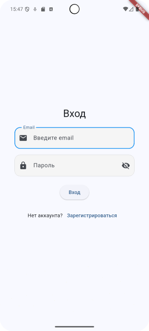
  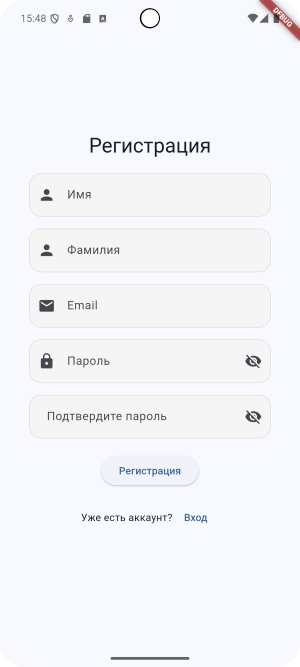
  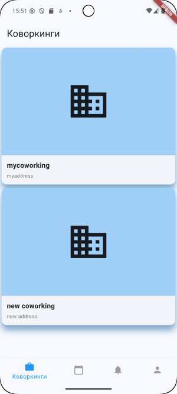
  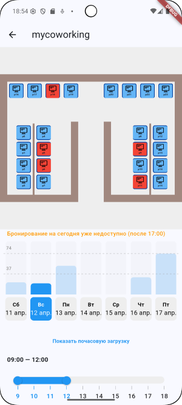
  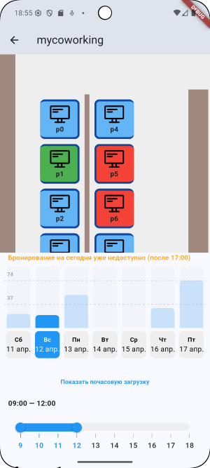
  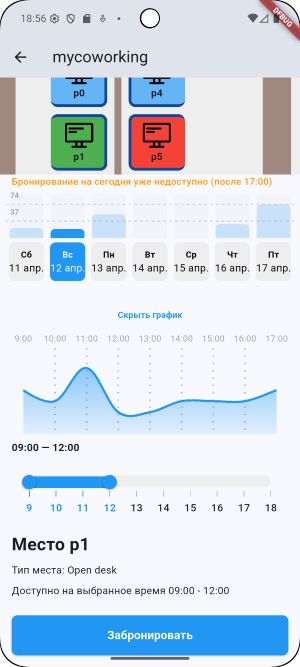
  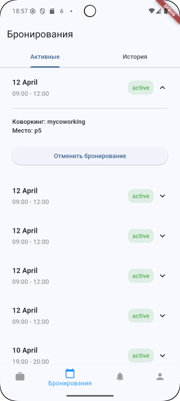
  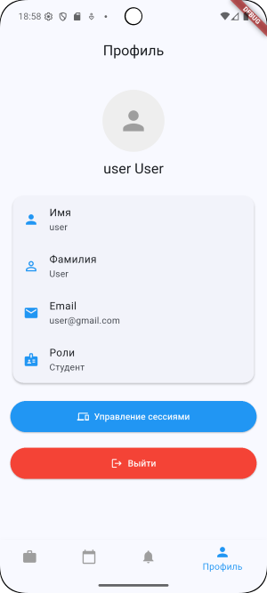
  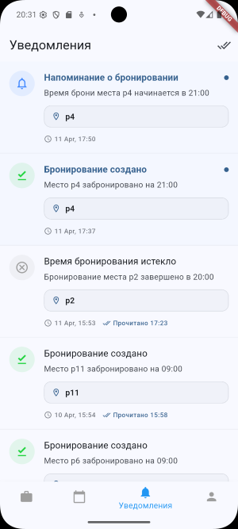
  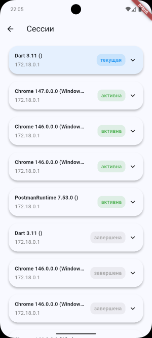

  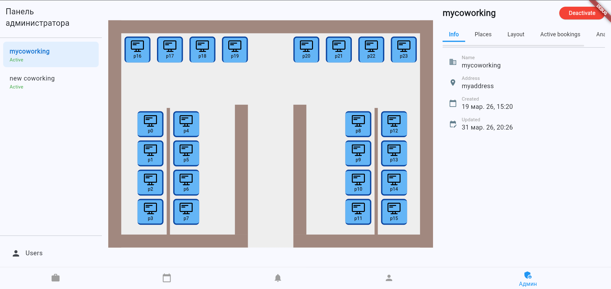
  
  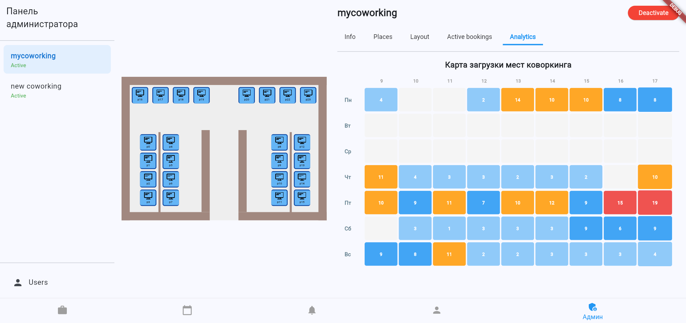
</details>
